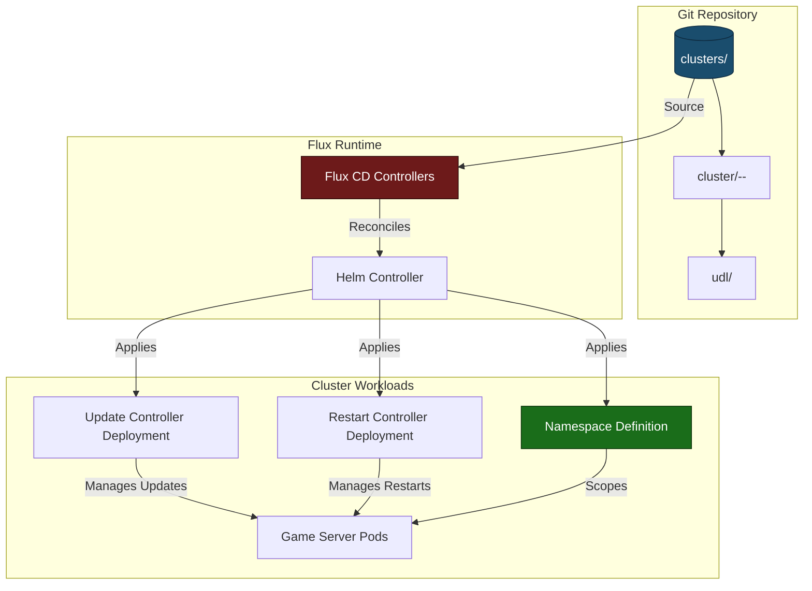
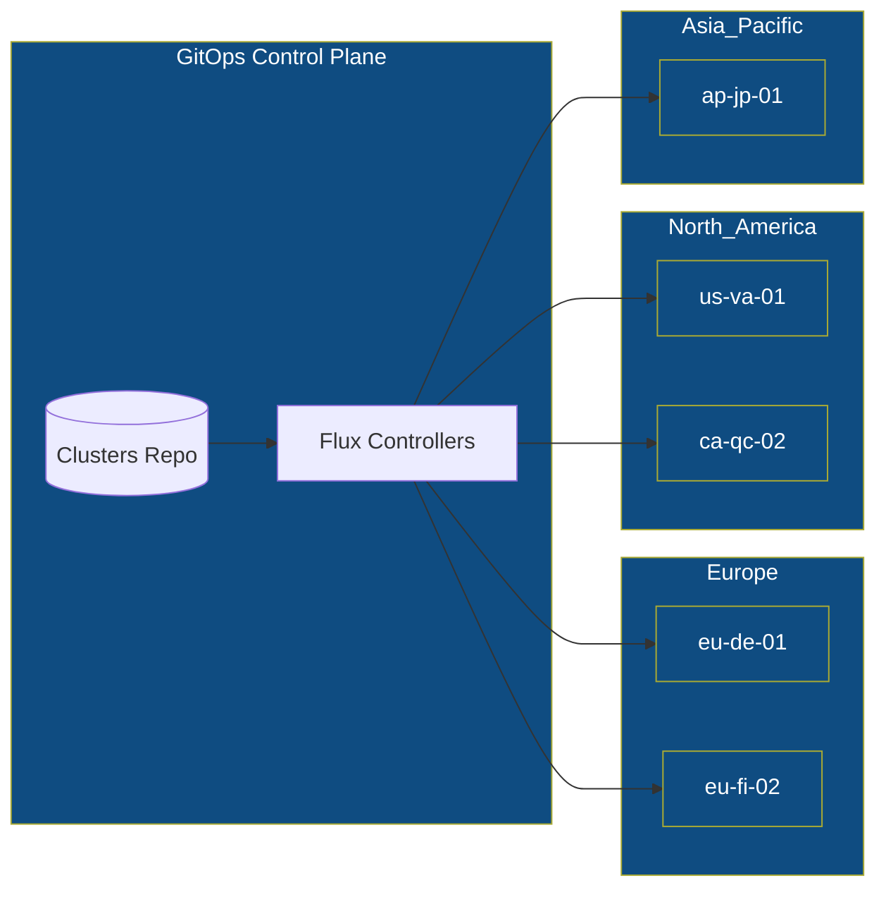
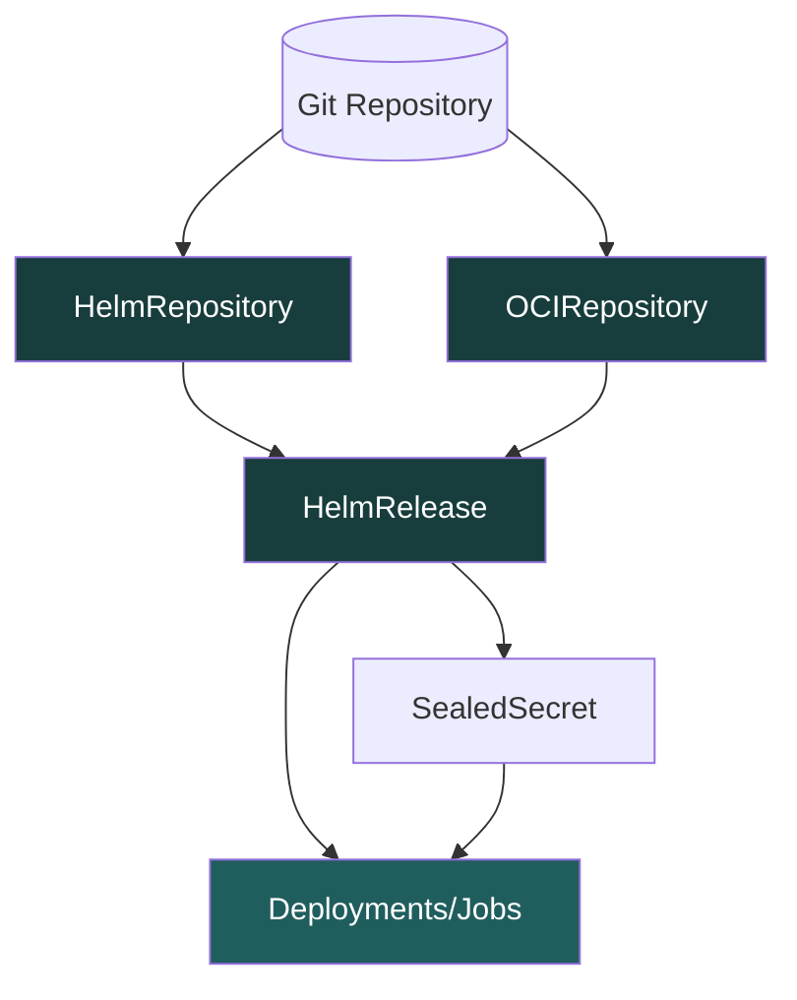
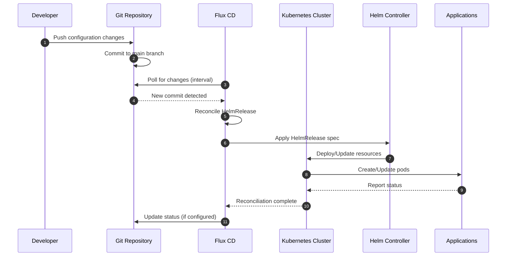
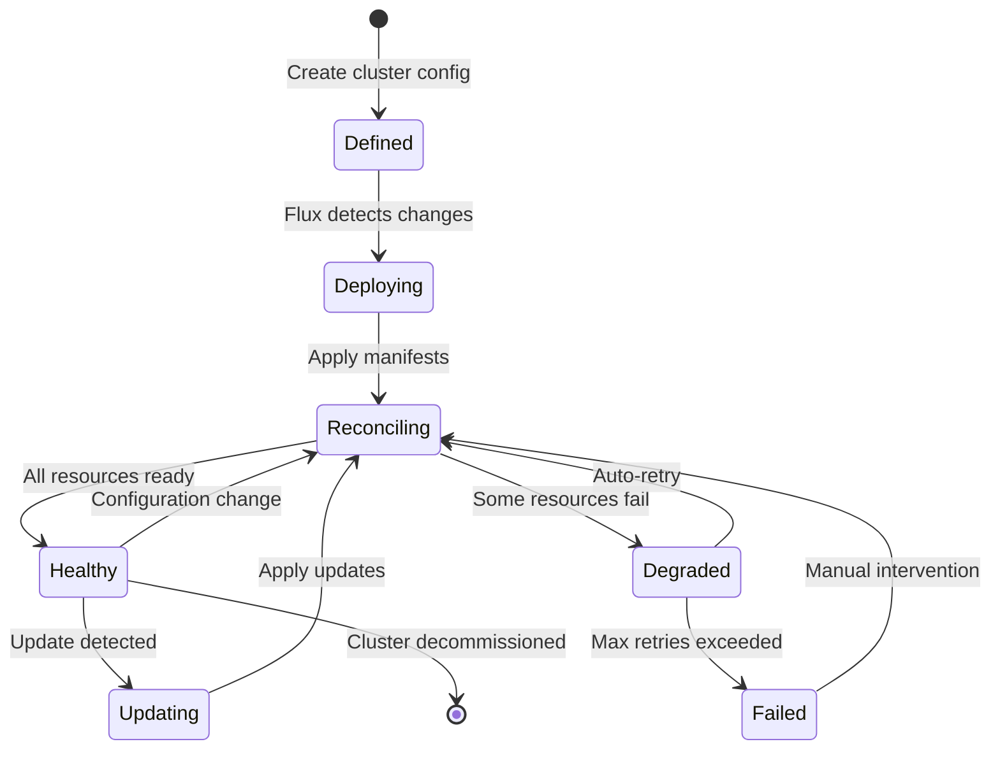

# Clusters

A GitOps-managed infrastructure repository template for defining Kubernetes cluster configurations and deployments across a global game server footprint.

[](LICENSE)

## Overview

The repository serves as the central source of truth for deploying and managing a global game server infrastructure across multiple geographic regions. It leverages GitOps principles with Flux CD for automated deployment and configuration management of Kubernetes clusters.

Each cluster path houses Flux artifacts, Helm releases, and namespace-scoped manifests that orchestrate controllers (update-controller, restart-controller) and supporting services. By maintaining infrastructure as code, it enables version-controlled, reproducible deployments across every cluster while ensuring consistency and reliability.

The hierarchy is intentionally generic—organized by region and cluster identifiers—so organizations can scale infrastructure globally while keeping clear separation of concerns between environments, namespaces, and services.

## Visualization Guide

- **Architecture Graph**: Highlights how repository assets feed Flux CD and how Helm releases populate namespaces.
- **Global Cluster Topology**: Shows how multiple regional clusters inherit the same GitOps workflow.
- **GitOps Deployment Flow**: Sequence diagram outlining end-to-end reconciliation.
- **Cluster Lifecycle State Machine**: Communicates operational states and transitions for each cluster.
- **Artifact Relationship Graph**: Details dependencies between Flux sources, Helm releases, and workloads.

### Key Responsibilities

- **Cluster Configuration**: Define and manage Kubernetes cluster configurations across multiple geographic regions using standardized naming conventions
- **GitOps Deployment**: Automate deployment of controllers and services through Flux CD-managed Helm releases
- **Namespace Management**: Organize and isolate services within appropriate Kubernetes namespaces
- **Infrastructure as Code**: Maintain all infrastructure definitions in version-controlled YAML manifests for auditability and reproducibility

## Architecture



### Global Cluster Topology



### Artifact Relationship Graph



## How It Works

### GitOps Deployment Flow



### Cluster Lifecycle State Machine



## Features

- **Geographic Distribution**: Support for multi-region deployments using ISO 3166-1 Alpha-2 country codes for consistent global infrastructure
- **Flux CD Integration**: Automated GitOps-based deployments with HelmRelease CRDs for declarative infrastructure management
- **Standardized Naming**: Hierarchical naming convention `[region]-[country_code]-[cluster_id].<org-domain>` for clear cluster identification
- **Controller Orchestration**: Centralized deployment of update-controller and restart-controller for game server lifecycle management
- **Namespace Isolation**: Logical separation of services within dedicated namespaces (e.g., `udl` namespace)
- **Helm Values Customization**: Per-cluster Helm value overrides for environment-specific configurations
- **Version Control**: Full audit trail of infrastructure changes through Git history
- **Declarative Configuration**: All infrastructure defined in YAML manifests for reproducibility and consistency
- **Scalable Structure**: Easy addition of new clusters and regions following established patterns
- **Kebab-case Convention**: Consistent folder and file naming using kebab-case for service definitions

## Prerequisites

- Kubernetes cluster (v1.25+) with appropriate RBAC permissions
- Flux CD v2 installed and configured on target clusters
- Access to the organization's OCI registry (or equivalent) for Helm charts
- Git access to the Clusters repository
- `kubectl` CLI tool for manual operations (optional)

## Installation

### Setting Up a New Cluster

1. **Create cluster directory structure**:
   ```bash
   mkdir -p cluster/[region]-[country_code]-[cluster_id]/{helm,udl}
   ```

2. **Define the namespace**:
   ```bash
   cat > cluster/[region]-[country_code]-[cluster_id]/udl/namespace.yaml <<EOF
   apiVersion: v1
   kind: Namespace
   metadata:
     name: udl
   EOF
   ```

3. **Add Helm releases**:
   - Create Helm repository definitions in `helm/` directory
   - Create service-specific Helm value overrides in `udl/[service-name]/helm-values.yaml`

4. **Bootstrap Flux CD** (on the cluster):
   ```bash
     flux bootstrap github \
         --owner=<github-org> \
         --repository=Clusters \
         --branch=main \
         --path=cluster/[region]-[country_code]-[cluster_id]
   ```

5. **Commit and push**:
   ```bash
   git add cluster/[region]-[country_code]-[cluster_id]
   git commit -m "Add [region]-[country_code]-[cluster_id] cluster"
   git push origin main
   ```

Flux CD will automatically detect the changes and deploy the defined resources to the cluster.

## Configuration

### Cluster Naming Convention

**Top-level cluster DNS**:
```
[region]-[country_code]-[cluster_id].<org-domain>
```

**Node-level DNS** (for reference):
```
n[node_id].[region]-[country_code]-[cluster_id].<org-domain>
```

Where:
- `region`: Geographic region (e.g., `eu`, `us`, `ap`)
- `country_code`: [ISO 3166-1 Alpha-2](https://en.wikipedia.org/wiki/ISO_3166-1) country code (e.g., `de`, `us`, `jp`)
- `cluster_id`: Two-digit cluster identifier (e.g., `01`, `02`)
- `node_id`: Node number within the cluster

**Example**: `eu-de-01.gameinfra.example` (Europe, Germany, Cluster 01)

### Directory Structure Conventions

- **Folders**: Use `kebab-case` - each folder defines a service
- **Files**: Follow hierarchical structure with number ordering when needed
- **Services**: Each service gets its own directory under the cluster's namespace directory

## Development

### Project Structure

```
Clusters/
├── cluster/                       # Cluster configurations
│   └── eu-de-01/                 # Example cluster (Europe, Germany, #01)
│       ├── helm/                 # Helm repository definitions
│       │   ├── restart-controller-helm.yaml
│       │   └── update-controller-helm.yaml
│       └── udl/                  # UDL namespace resources
│           ├── namespace.yaml    # Namespace definition
│           ├── restart-controller/
│           │   └── helm-values.yaml
│           └── update-controller/
│               └── helm-values.yaml
├── LICENSE                        # MIT License
└── README.md                      # This file
```

### Adding a New Service

1. Create a new directory under `cluster/[cluster-name]/udl/[service-name]/`
2. Add `helm-values.yaml` with service-specific configuration
3. Create corresponding Helm repository reference in `cluster/[cluster-name]/helm/`
4. Commit and push - Flux will handle deployment

### Adding a New Cluster

1. Follow the directory structure pattern from existing clusters
2. Use proper naming convention: `[region]-[country_code]-[cluster_id]`
3. Copy and adapt configurations from existing clusters
4. Bootstrap Flux CD on the new cluster pointing to the new path

## License

See [LICENSE](LICENSE) file for details.

## Dependencies

- [Flux CD v2](https://fluxcd.io/) - GitOps toolkit for Kubernetes
- [Helm](https://helm.sh/) - Kubernetes package manager
- [update-controller](https://github.com/UDL-TF) or equivalent service - Controller for managing game server updates
- [restart-controller](https://github.com/UDL-TF) or equivalent service - Controller for managing game server restarts